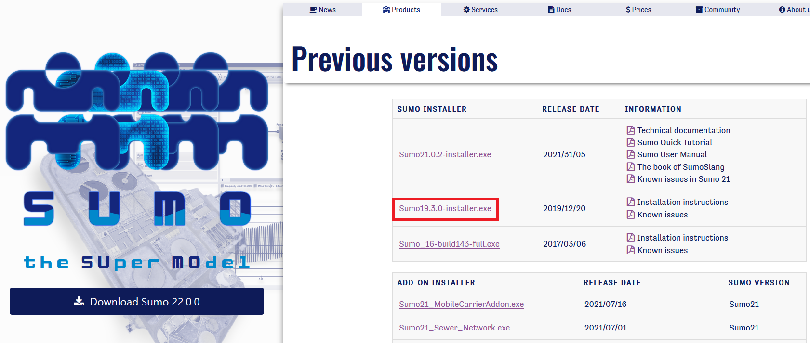
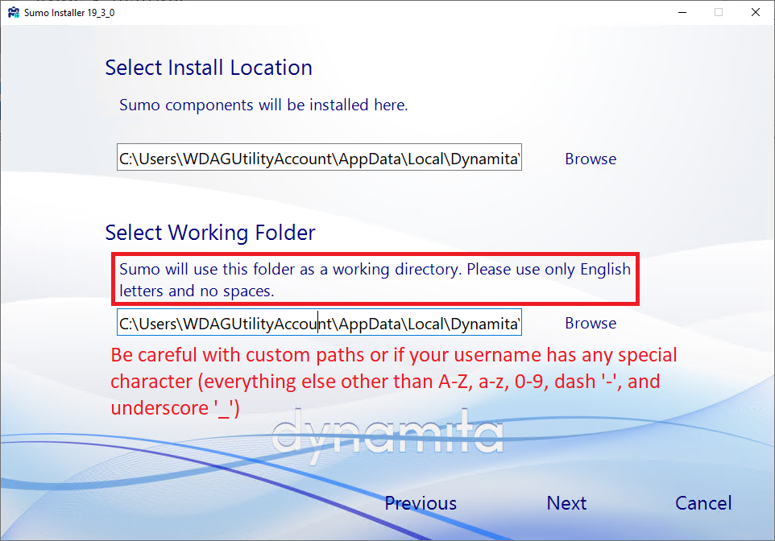
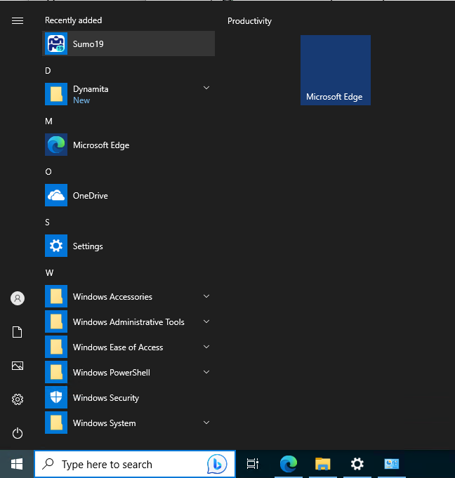

# Install and activate SUMO19

## 1. Download

Goto https://dynamita.com/previous-version.html and click to download `Sumo19.3.0-installer.exe`.
In this course we will stick with SUMO19 and ignore the newer versions (i.e. SUMO21 and SUMO22).

## 2. Install

Open the downloaded installer and follow the installation wizard.
In the `Select Install Location` step, be careful that the paths should not contain any special characters (any character other than letters (A-Z and a-z), digits (0-9), and underscore (_)).

Continue the installation until it finishes.

## 3. Acquire and submit the machine identification code (MIC)

Launch SUMO19; you will probably be able to do it from the start menu after a successful installation:

On the first run the program will ask for a valid license.

Click the button `I need a new license`, two more buttons will show up, among which click `Copy MIC`, shown as below:

An encoded MIC string will be copied into clipboard, paste it on canvas and submit. We'll contact Dynamita for a teaching license for each submitted MIC.

Note that the MIC is hardware-specific and *can* change after OS reinstall or essential hardware upgrade (e.g. the motherboard with respect to a desktop).
If you lose access to SUMO during this semester, re-send the MIC to acquire another license.